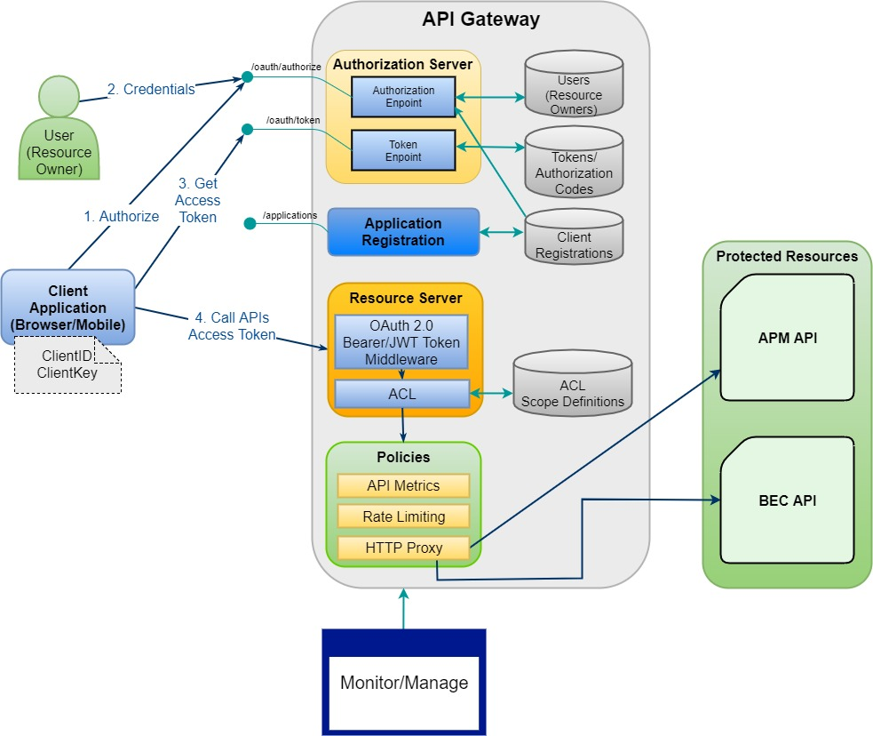

# Dependencies
 - [MongoDB Installation](https://docs.mongodb.com/manual/installation/)
 - [Nodejs Installation (recommend version 8.9.4 LTS)](https://nodejs.org/en/)
 - [Strongloop/Loopback framework version 3](https://strongloop.com/)

# Overview

This project includes two services:
 - [api_server](#api-server)
 - [auth_server](#api-gatewayauthorization-server)
 - Client application

The following diagram illustrates architecture of the project:


## `API server`

### /api/notes endpoint

## `API Gateway/Authorization server`

### /oauth/authorize endpoint

### /oauth/token endpoint

# Run services
Make sure the MongoDB serivce is already running.
```
# For Linux:
$ sudo service mongod start

Check service status:
$ sudo service mongod status
```

At the root directory of the repositoty:
```
$ cd auth_server
$ npm install
$ slc start
$ cd ../api_server
$ npm install
$ slc start
```

# Demo scenario

1. The API server is protected by API Gateway from unauthorized clients:
    - Access to: https://localhost:3101/api/notes
    - Response "Unauthorized"

2. Sign up new user then verify registration via email.
    - Access Client Home page at: https://localhost:3101/
    - Click on **Sign Up** to register a new user with user name, password, email.
    - Check email to verify the registration.

3. Authenticating with Authorization Server follow **OAuth 2.0 Resource Owner Password Credentials flow**.
    - At the client home page, choose *Resource owner password credentials*
    - Enter username/password -> Sign In

> After authenticated/authorized, client is on behalf of resource owner to get an Access Token which is used to access protected resource content.In this demo, the API server (resource server) exposes the API endpoint /api/nodes. 

4. On the client Signed In page, use obtained Access Token (attached in request URL) to call to API endpoint at https://localhost:3101/api/notes, then verify the sucess response.

5. Additional feature: Reset Password.
    - On the client Sign In page, click on **Forgot password?**.
    - Enter the user's email.
    - Check email for getting Reset Password link.
    - Enter new password.
    - Sign In with the new password.

# TODO
- Modifiable token claims.
- User Roles.
- Access Control.
